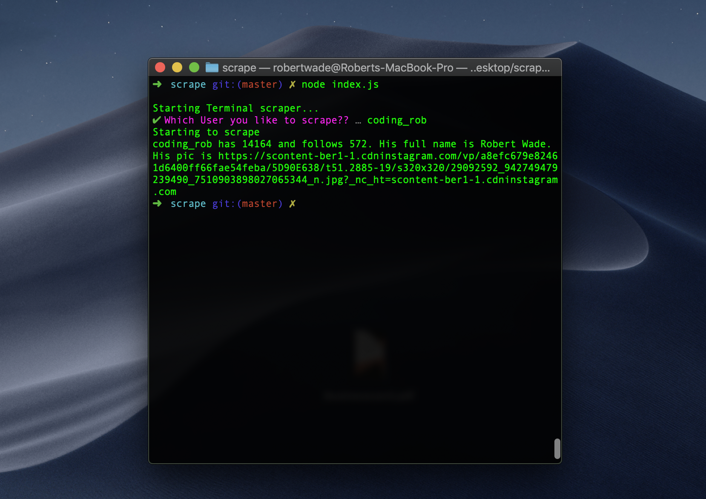

# instagram-scraper
Nodejs Terminal Instagram Scraper for scraping Followers, Followings and Profilepicture of Users from Instagram.


## Project setup

Open the terminal and change the directory
```
cd instagram-scraper
```

Install the node modules with the following command

```
yarn
```

or

```
npm install
```

## Usage

In the Terminal enter the following

```
node index.js
```

Then you need to enter a Instagram username


## Example


